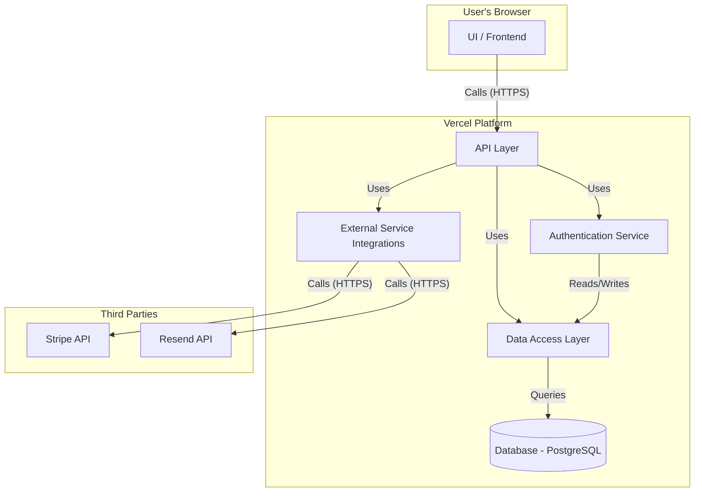

# Components

## Component List
- **UI / Frontend**: Handles all user interface rendering and client-side state.
- **API Layer**: Serves as the secure, type-safe boundary between client and server.
- **Data Access Layer**: Manages all communication with the database via Prisma.
- **Authentication Service**: Handles all user sign-in and session management via NextAuth.js.
- **External Service Integrations**: Encapsulates all communication with third-party APIs (Stripe, Resend).

## Component Diagram

