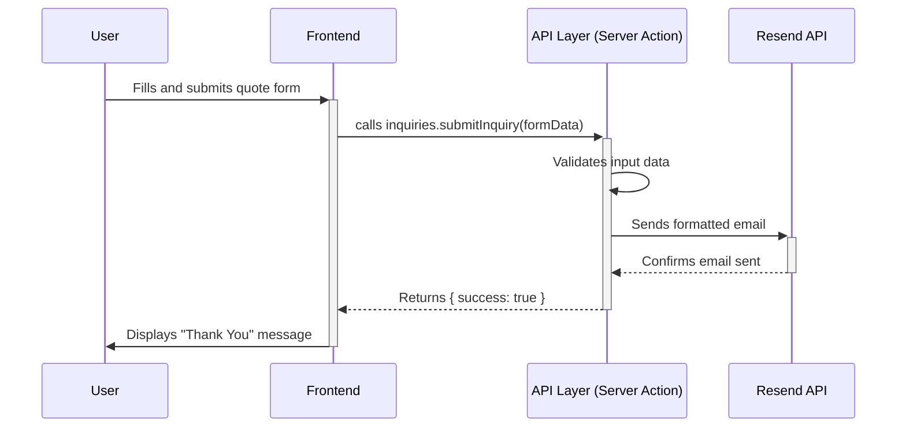
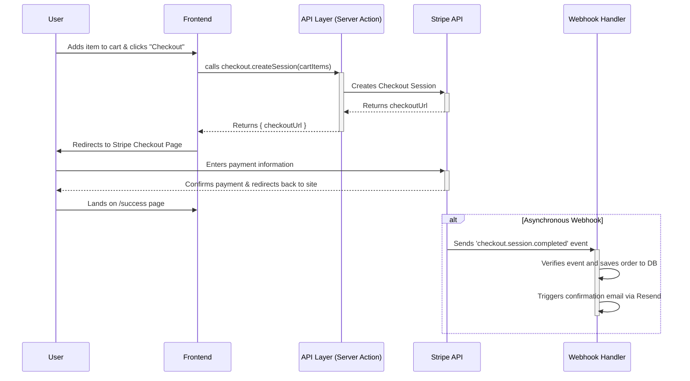

# Core Workflows

## Quote Request Submission

```mermaid
sequenceDiagram
    participant User
    participant Frontend
    participant API Layer (Server Action)
    participant Resend API

    User->>+Frontend: Fills and submits quote form
    Frontend->>+API Layer (Server Action): calls inquiries.submitInquiry(formData)
    API Layer (Server Action)->>API Layer (Server Action): Validates input data
    API Layer (Server Action)->>+Resend API: Sends formatted email
    Resend API-->>-API Layer (Server Action): Confirms email sent
    API Layer (Server Action)-->>-Frontend: Returns { success: true }
    Frontend->>-User: Displays "Thank You" message
```

## Accessory Purchase & Order Fulfillment

```mermaid
sequenceDiagram
    participant User
    participant Frontend
    participant API Layer (Server Action)
    participant Stripe API
    participant Webhook Handler

    User->>Frontend: Adds item to cart & clicks "Checkout"
    Frontend->>+API Layer (Server Action): calls checkout.createSession(cartItems)
    API Layer (Server Action)->>+Stripe API: Creates Checkout Session
    Stripe API-->>-API Layer (Server Action): Returns checkoutUrl
    API Layer (Server Action)-->>-Frontend: Returns { checkoutUrl }
    Frontend->>User: Redirects to Stripe Checkout Page

    User->>+Stripe API: Enters payment information
    Stripe API-->>-User: Confirms payment & redirects back to site
    User->>Frontend: Lands on /success page

    alt Asynchronous Webhook
        Stripe API->>+Webhook Handler: Sends 'checkout.session.completed' event
        Webhook Handler->>Webhook Handler: Verifies event and saves order to DB
        Webhook Handler->>-Webhook Handler: Triggers confirmation email via Resend
    end
```