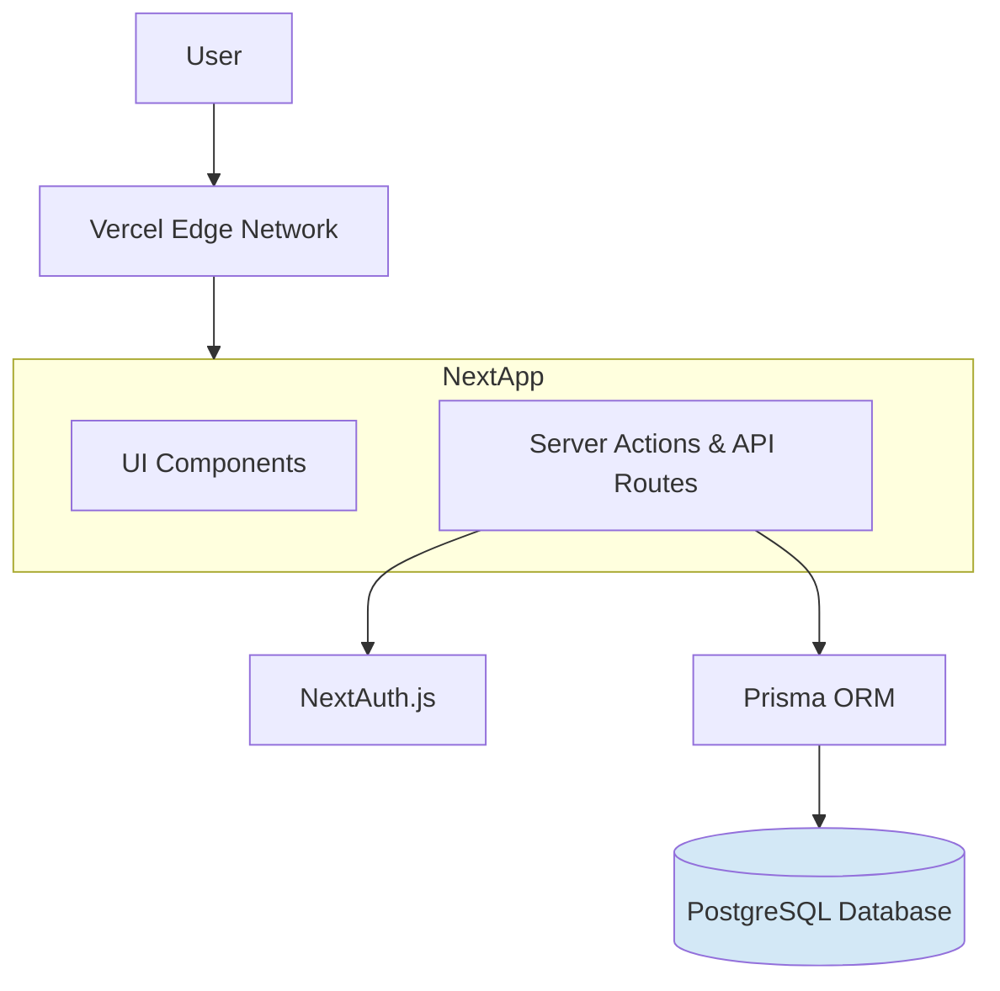

# High Level Architecture

## Technical Summary
This project will be a full-stack, type-safe web application built using the T3 Stack. It leverages Next.js for both frontend rendering and backend API logic, deployed monolithically on the Vercel platform. The architecture is serverless-first, using Prisma for database access, NextAuth for authentication, and Tailwind CSS for styling. This integrated approach within a monorepo ensures a cohesive, maintainable, and highly performant system.

## Platform and Infrastructure Choice
* **Platform:** Vercel
* **Key Services:** Next.js Hosting, Serverless Functions, Global Edge Network (CDN).
* **Rationale:** Vercel is the creator of Next.js and provides a seamless, zero-configuration deployment experience that is highly optimized for this specific stack.

## Repository Structure
* **Structure:** Monorepo
* **Rationale:** This is the default and recommended structure for the T3 Stack, enabling seamless, end-to-end type-sharing between the frontend components and the backend database schemas.

## High Level Architecture Diagram

## Architectural Patterns
Full-stack Framework: Using Next.js as a single, integrated framework for both client-side UI and server-side logic.

End-to-End Type Safety: Leveraging TypeScript, Zod, and Prisma to ensure data types are consistent and validated from the database all the way to the UI components.

Serverless-First: Utilizing Vercel's serverless functions for API routes and Server Actions, ensuring automatic scaling and reduced operational overhead.

Component-Based UI: Employing React to build the user interface as a collection of declarative, reusable components.